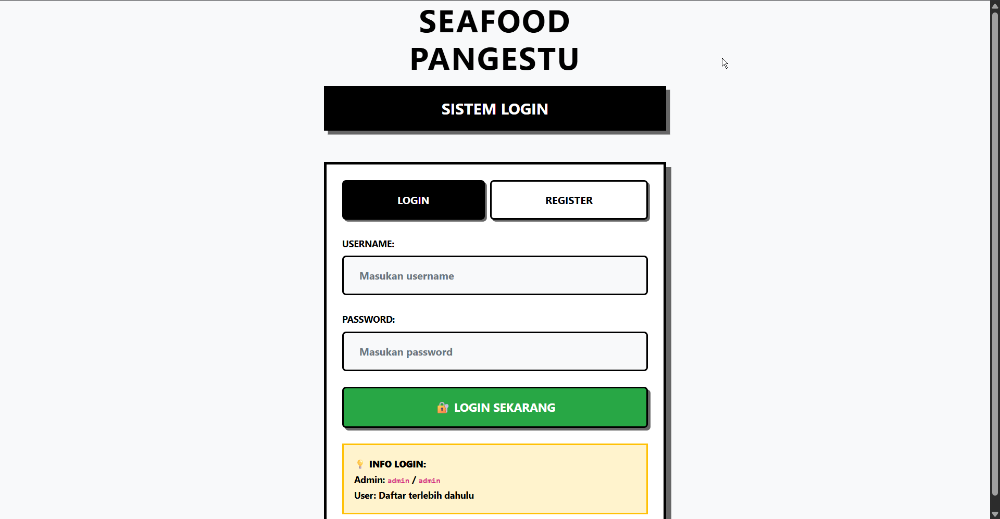
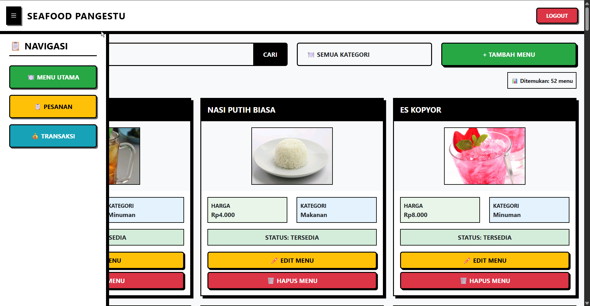
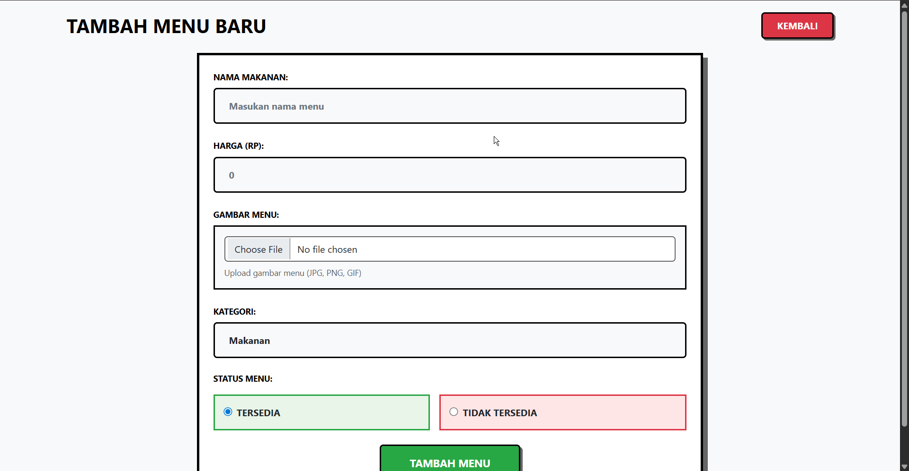
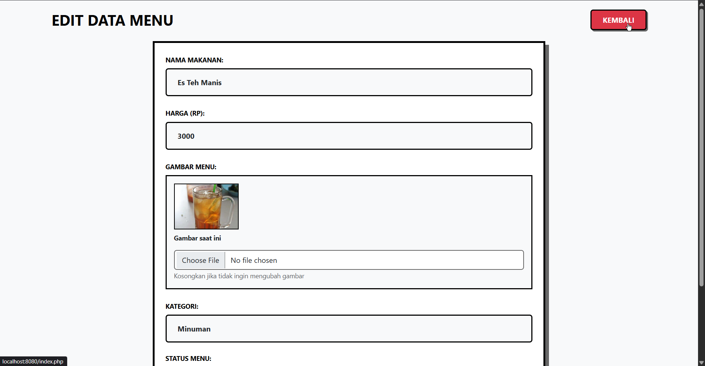
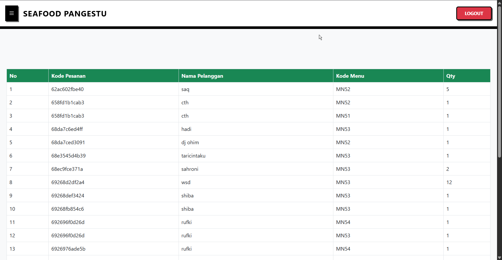
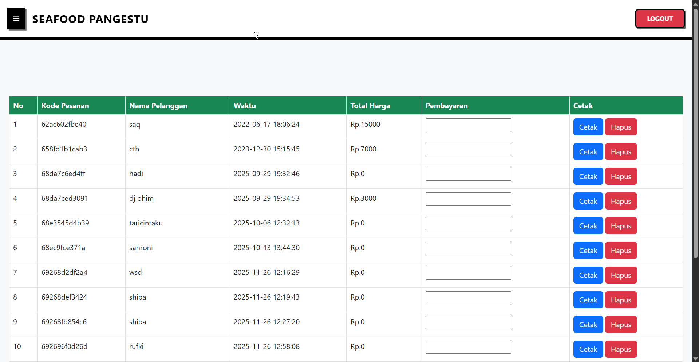
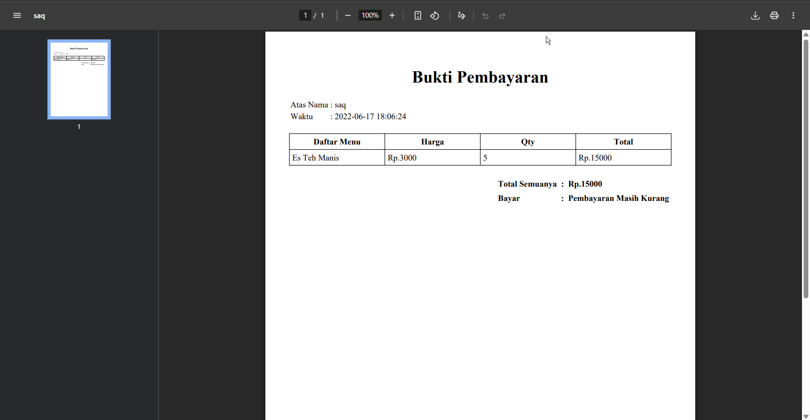
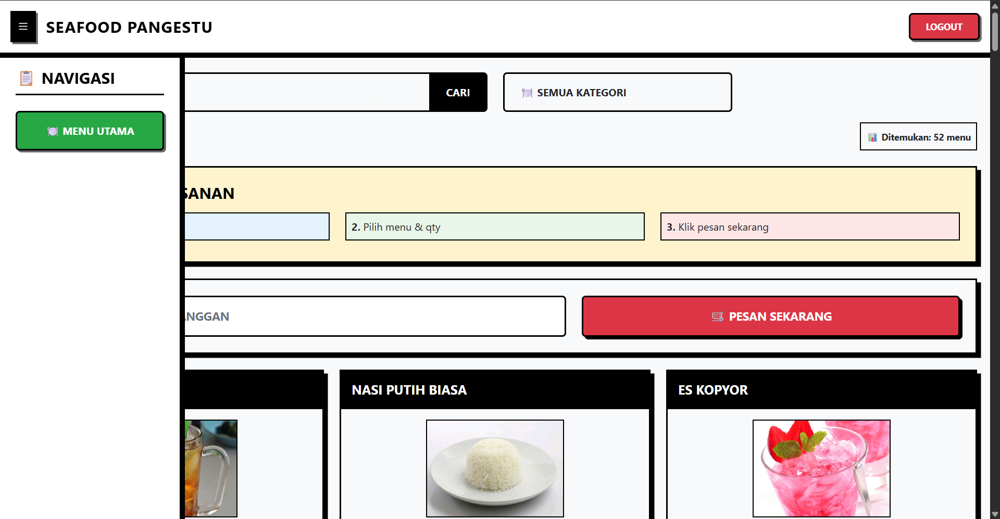
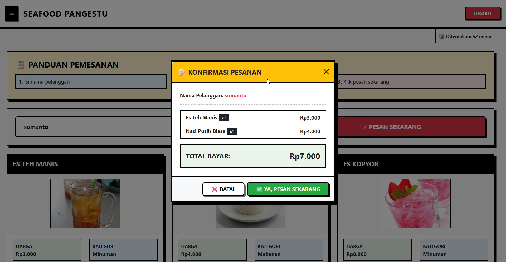

# 🦐 Kasir Seafood Pangestu

Aplikasi kasir (POS) berbasis web untuk Restoran Seafood Pangestu. Dibangun pakai PHP native, MySQL, dan Bootstrap 5.


---

## Tentang Project

Project ini adalah sistem kasir restoran yang punya 2 role user:
- **Admin** — bisa kelola menu (tambah/edit/hapus), lihat data pesanan, kelola transaksi, dan cetak struk PDF
- **User/Pembeli** — bisa lihat daftar menu dan melakukan pemesanan

Fitur yang tersedia:
- Login & Register (admin dan user terpisah)
- CRUD menu makanan/minuman (admin only)
- Pencarian menu + filter berdasarkan kategori
- Sistem pemesanan dengan konfirmasi modal
- Halaman transaksi + cetak bukti pembayaran ke PDF (pakai DomPDF)
- UI pakai style Neo-Brutalism

---

## Tech Stack

- **PHP 8.x** (native, tanpa framework)
- **MySQL / MariaDB**
- **Bootstrap 5.2** + Bootstrap Icons
- **DomPDF** untuk generate PDF
- **JavaScript** vanilla untuk interaksi UI

---

## Struktur Folder

```
Kasir_Seafood_Pangestu/
├── index.php                 -> halaman utama
├── login.php                 -> login & register
├── logout.php                -> logout
├── function.php              -> semua fungsi backend
├── tambah.php                -> form tambah menu (admin)
├── edit.php                  -> form edit menu (admin)
├── hapus.php                 -> hapus menu/transaksi (admin)
├── pwl_kasir_restoran.sql    -> file SQL database
├── halaman/
│   ├── beranda.php           -> grid menu + form pesan
│   ├── pesanan.php           -> tabel pesanan
│   └── transaksi.php         -> tabel transaksi + cetak
├── cetak/
│   ├── cetak.php             -> generate PDF
│   ├── page.php              -> template struk
│   └── dompdf/               -> library DomPDF
├── src/
│   ├── css/                  -> Bootstrap CSS & Icons
│   ├── img/                  -> gambar-gambar menu
│   └── js/
│       ├── beranda.js        -> toggle sidebar
│       └── login.js          -> tab login/register
└── images/                   -> screenshot aplikasi
```

---

## Database

Nama database: `pwl_kasir_restoran`

Ada 5 tabel:

**admin** — menyimpan akun admin
| Kolom | Tipe | Keterangan |
|-------|------|------------|
| id | INT | PK, Auto Increment |
| username | VARCHAR(255) | |
| password | VARCHAR(255) | hash MD5 |

**user** — menyimpan akun pembeli
| Kolom | Tipe | Keterangan |
|-------|------|------------|
| id_user | INT | PK, Auto Increment |
| username | VARCHAR(255) | |
| password | VARCHAR(255) | hash MD5 |

**menu** — daftar semua menu
| Kolom | Tipe | Keterangan |
|-------|------|------------|
| id_menu | INT | PK |
| kode_menu | VARCHAR(12) | format: MN01, MN02, dst |
| nama | VARCHAR(100) | nama menu |
| harga | INT | harga (Rupiah) |
| gambar | VARCHAR(100) | nama file gambar |
| kategori | VARCHAR(100) | Makanan / Fast Food / Snack / Dessert / Minuman |
| status | ENUM | tersedia / tidak tersedia |

**pesanan** — data pesanan pelanggan
| Kolom | Tipe | Keterangan |
|-------|------|------------|
| id_pesanan | INT | PK, Auto Increment |
| kode_pesanan | VARCHAR(12) | kode unik tiap pesanan |
| kode_menu | VARCHAR(12) | relasi ke tabel menu |
| qty | INT | jumlah |

**transaksi** — riwayat transaksi
| Kolom | Tipe | Keterangan |
|-------|------|------------|
| id_transaksi | INT | PK, Auto Increment |
| kode_pesanan | VARCHAR(12) | relasi ke tabel pesanan |
| nama_pelanggan | VARCHAR(50) | |
| waktu | DATETIME | waktu transaksi dibuat |

---

## Cara Install

Requirements :
- PHP 8.x
- MySQL / MariaDB
- XAMPP / Laragon / atau langsung pakai `php -S`

Langkah-langkah:

1. Clone repo
   ```bash
   git clone https://github.com/cybha22/Kasir_Seafood_Pangestu.git
   ```

2. Buat database `pwl_kasir_restoran` di phpMyAdmin, lalu import file `pwl_kasir_restoran.sql`

3. Cek koneksi database di `function.php`, sesuaikan jika perlu:
   ```php
   $koneksi = mysqli_connect("localhost", "root", "", "pwl_kasir_restoran");
   ```

4. Jalankan server
   ```bash
   php -S localhost:8080
   ```

5. Buka `http://localhost:8080` di browser

**Akun default:**
| Role | Username | Password |
|------|----------|----------|
| Admin | `admin` | `admin` |
| User | register sendiri | - |

---

## Screenshot

### Halaman Login

<p align="center">
  
</p>

### Tampilan Admin

**Beranda** — daftar menu ditampilkan dalam bentuk card. Ada fitur search, filter kategori, tambah/edit/hapus menu.

<p align="center">
  
</p>

**Tambah Menu**

<p align="center">
  
</p>

**Edit Menu**

<p align="center">
  
</p>

**Data Pesanan**

<p align="center">
  
</p>

**Data Transaksi** — admin bisa input nominal pembayaran, cetak struk, atau hapus transaksi.

<p align="center">
  
</p>

**Cetak Struk (PDF)**

<p align="center">
  
</p>

### Tampilan Pembeli

**Beranda** — pembeli bisa lihat menu, isi nama, pilih qty, dan pesan.

<p align="center">
  
</p>

**Konfirmasi Pesanan** — sebelum submit, muncul konfirmasi yang nunjukin ringkasan pesanan dan total bayar.

<p align="center">
  
</p>

---

## Author

**cybha22** — [github.com/cybha22](https://github.com/cybha22)
